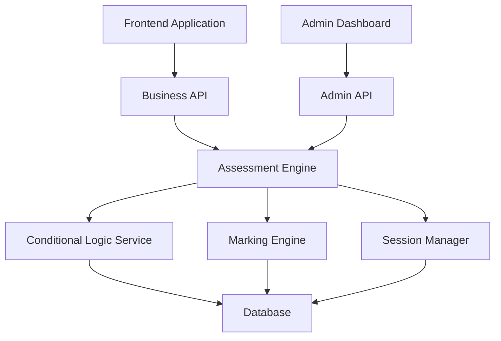

# API Integration Guide

This comprehensive guide provides everything you need to integrate with the Assessment Platform API. It covers the complete workflow from creating assessments with conditional logic to implementing automated grading and managing user sessions.

## 📚 Documentation Overview

### Core Guides
1. **[Conditional Sections Guide](CONDITIONAL_SECTIONS_GUIDE.md)** - Create dynamic, personalized assessments
2. **[Marking Scheme Flow Guide](MARKING_SCHEME_FLOW_GUIDE.md)** - Implement automated grading systems
3. **[Session Management Guide](SESSION_MANAGEMENT_GUIDE.md)** - Handle user sessions from start to completion

### Supporting Documentation
- **[API Overview](API_OVERVIEW.md)** - Complete API reference
- **[Marking Scheme and Rules](MARKING_SCHEME_AND_RULES.md)** - Detailed rule types and parameters
- **[Authentication & Authorization](AUTHENTICATION_AUTHORIZATION_SYSTEM.md)** - Security implementation

## 🚀 Quick Start Integration

### 1. Authentication Setup
```http
POST /api/v1/auth/login
Content-Type: application/json

{
  "email": "admin@company.com",
  "password": "secure_password"
}
```

### 2. Create Assessment with Conditional Logic
```http
POST /api/v1/admin/assessments
Authorization: Bearer {token}

{
  "assessment": {
    "title": "Product Import Readiness Assessment",
    "description": "Comprehensive evaluation for import approval"
  }
}
```

### 3. Set Up Automated Grading
```http
POST /api/v1/admin/assessments/123/marking-schemes
Authorization: Bearer {admin_token}

{
  "marking_scheme": {
    "name": "Import Readiness Scoring",
    "settings": {
      "passing_score": 50.0,
      "grade_boundaries": {
        "Import Ready": 50,
        "Not Import Ready": 0
      }
    }
  }
}
```

### 4. Start User Session
```http
POST /api/v1/business/assessments/123/response-sessions
Authorization: Bearer {user_token}

{
  "response_session": {
    "respondent_name": "John Smith"
  }
}
```

## 🏗️ Architecture Overview

### System Components


### Data Flow
1. **Admin Setup**: Create assessments, configure conditional logic, set up marking schemes
2. **User Experience**: Start sessions, navigate through conditional sections, submit responses
3. **Automated Processing**: Grade responses, apply conditional logic, generate results

## 📋 Integration Checklist

### Phase 1: Basic Setup
- [ ] Set up authentication system
- [ ] Create basic assessment structure
- [ ] Implement session management
- [ ] Test basic user flow

### Phase 2: Advanced Features
- [ ] Configure conditional sections
- [ ] Set up automated marking
- [ ] Implement dynamic navigation
- [ ] Add progress tracking

### Phase 3: Production Ready
- [ ] Error handling and validation
- [ ] Performance optimization
- [ ] Security hardening
- [ ] Monitoring and analytics

## 🔧 Common Integration Patterns

### 1. Multi-Step Assessment Flow
```javascript
class AssessmentFlow {
  async startAssessment(assessmentId) {
    // Create session
    const session = await this.createSession(assessmentId);

    // Start session and get first section
    const startResult = await this.startSession(session.id);

    // Navigate to first section
    return this.navigateToSection(startResult.meta.first_section_id);
  }

  async submitSection(sessionId, sectionId, responses) {
    // Submit responses
    const result = await this.submitSectionResponses(sessionId, sectionId, responses);

    // Handle conditional logic
    if (result.meta.next_section_id) {
      return this.navigateToSection(result.meta.next_section_id);
    } else {
      return this.completeAssessment(sessionId);
    }
  }
}
```

### 2. Conditional Section Handler
```javascript
class ConditionalSectionManager {
  async evaluateVisibility(sessionId, responses) {
    // Submit responses
    const result = await this.api.submitSection(sessionId, responses);

    // Check for new sections
    if (result.meta.conditional_sections_revealed) {
      this.showNewSections(result.meta.conditional_sections_revealed);
    }

    // Hide sections that are no longer relevant
    if (result.meta.conditional_sections_hidden) {
      this.hideSections(result.meta.conditional_sections_hidden);
    }

    return result;
  }
}
```

### 3. Automated Grading Integration
```javascript
class GradingSystem {
  async setupMarkingScheme(assessmentId) {
    // Create marking scheme
    const scheme = await this.createMarkingScheme(assessmentId, {
      name: "Automated Scoring",
      settings: {
        passing_score: 50.0,
        grade_boundaries: {
          "Excellent": 90,
          "Good": 75,
          "Satisfactory": 50,
          "Needs Improvement": 0
        }
      }
    });

    // Create rules for each question
    const questions = await this.getAssessmentQuestions(assessmentId);
    for (const question of questions) {
      await this.createMarkingRule(scheme.id, question.id);
    }

    // Activate scheme
    return this.activateScheme(scheme.id);
  }
}
```

## 🎯 Use Case Examples

### 1. Import Readiness Assessment
**Scenario**: Determine if products are ready for import based on compliance, quality, and documentation.

**Implementation**:
- Conditional sections based on product type
- Weighted scoring for different criteria
- Automated pass/fail determination
- Detailed feedback for improvements

**Key Features**:
```javascript
// Conditional logic: Show compliance section only for regulated products
{
  "is_conditional": true,
  "visibility_conditions": {
    "trigger_question_id": 123,
    "trigger_response_type": "option_selected",
    "trigger_values": ["regulated_product"],
    "operator": "contains"
  }
}

// Marking scheme: 50% threshold for import readiness
{
  "grade_boundaries": {
    "Import Ready": 50,
    "Not Import Ready": 0
  }
}
```

### 2. Business Qualification Assessment
**Scenario**: Assess business readiness for different service tiers based on size, revenue, and needs.

**Implementation**:
- Multi-branch conditional logic
- Dynamic pricing sections
- Automated tier assignment
- Personalized recommendations

### 3. Compliance Audit Assessment
**Scenario**: Evaluate regulatory compliance across different jurisdictions and industries.

**Implementation**:
- Geographic conditional sections
- Industry-specific questions
- Weighted compliance scoring
- Risk level determination

## 🔍 Advanced Features

### 1. Real-Time Conditional Logic
```javascript
// Monitor responses and update UI dynamically
class RealTimeAssessment {
  async onResponseChange(questionId, value) {
    // Update response
    await this.updateResponse(questionId, value);

    // Check for conditional changes
    const visibility = await this.checkSectionVisibility();

    // Update UI based on changes
    this.updateSectionVisibility(visibility);
  }
}
```

### 2. Progressive Disclosure
```javascript
// Reveal complexity gradually based on user responses
class ProgressiveDisclosure {
  async handleBasicToAdvanced(responses) {
    if (this.isAdvancedUser(responses)) {
      await this.revealAdvancedSections();
    } else {
      await this.showSimplifiedFlow();
    }
  }
}
```

### 3. Multi-Language Support
```javascript
// Handle internationalization in assessments
class I18nAssessment {
  async loadAssessment(assessmentId, locale = 'en') {
    const assessment = await this.api.getAssessment(assessmentId);
    return this.localizeContent(assessment, locale);
  }
}
```

## 📊 Monitoring and Analytics

### Key Metrics to Track
- Session completion rates
- Section drop-off points
- Conditional logic effectiveness
- Grading accuracy
- Performance metrics

### Implementation Example
```javascript
class AssessmentAnalytics {
  trackSectionCompletion(sectionId, completionTime) {
    this.analytics.track('section_completed', {
      section_id: sectionId,
      completion_time: completionTime,
      user_id: this.currentUser.id
    });
  }

  trackConditionalLogic(sectionId, wasRevealed) {
    this.analytics.track('conditional_section', {
      section_id: sectionId,
      revealed: wasRevealed,
      trigger_responses: this.getCurrentResponses()
    });
  }
}
```

## 🛡️ Security Best Practices

### 1. Authentication & Authorization
- Use JWT tokens with appropriate expiration
- Implement role-based access control
- Validate user permissions for each operation

### 2. Data Validation
- Validate all input data server-side
- Sanitize user responses
- Implement rate limiting

### 3. Session Security
- Encrypt sensitive session data
- Implement session timeout
- Prevent session hijacking

## 🚨 Error Handling Strategies

### 1. Graceful Degradation
```javascript
class RobustAssessment {
  async submitWithFallback(sessionId, responses) {
    try {
      return await this.api.submitResponses(sessionId, responses);
    } catch (error) {
      if (error.type === 'NetworkError') {
        // Store locally and retry later
        return this.storeOffline(sessionId, responses);
      } else if (error.type === 'ValidationError') {
        // Show validation errors to user
        return this.handleValidationErrors(error.details);
      } else {
        // Log error and show generic message
        this.logError(error);
        throw new UserFriendlyError('Something went wrong. Please try again.');
      }
    }
  }
}
```

### 2. Retry Logic
```javascript
class RetryableAPI {
  async callWithRetry(apiCall, maxRetries = 3) {
    for (let i = 0; i < maxRetries; i++) {
      try {
        return await apiCall();
      } catch (error) {
        if (i === maxRetries - 1 || !this.isRetryable(error)) {
          throw error;
        }
        await this.delay(Math.pow(2, i) * 1000); // Exponential backoff
      }
    }
  }
}
```

## 📈 Performance Optimization

### 1. Caching Strategies
- Cache assessment structure
- Store user responses locally
- Implement smart prefetching

### 2. Lazy Loading
- Load sections on demand
- Defer non-critical resources
- Implement virtual scrolling for large question sets

### 3. Network Optimization
- Compress API responses
- Use HTTP/2 multiplexing
- Implement request batching

## 🧪 Testing Strategies

### 1. Unit Testing
```javascript
describe('ConditionalLogic', () => {
  test('should show section when condition is met', async () => {
    const logic = new ConditionalLogic();
    const result = await logic.evaluate({
      trigger_question_id: 123,
      trigger_response: 'Corporation',
      conditions: { /* ... */ }
    });
    expect(result.visible).toBe(true);
  });
});
```

### 2. Integration Testing
```javascript
describe('AssessmentFlow', () => {
  test('should complete full assessment flow', async () => {
    const flow = new AssessmentFlow();
    const session = await flow.startAssessment(123);

    // Submit responses for each section
    for (const section of assessment.sections) {
      await flow.submitSection(session.id, section.id, mockResponses);
    }

    expect(session.state).toBe('completed');
  });
});
```

### 3. End-to-End Testing
```javascript
describe('E2E Assessment', () => {
  test('should handle conditional sections correctly', async () => {
    await page.goto('/assessments/123');
    await page.fill('[data-testid="business-name"]', 'Test Corp');
    await page.selectOption('[data-testid="business-type"]', 'Corporation');
    await page.click('[data-testid="submit-section"]');

    // Verify conditional section appears
    await expect(page.locator('[data-testid="corporate-governance"]')).toBeVisible();
  });
});
```

## 📞 Support and Resources

### Getting Help
- **Documentation**: Comprehensive guides and API reference
- **Support Team**: Technical support for integration issues
- **Community**: Developer community and forums

### Additional Resources
- **SDK Libraries**: Official SDKs for popular languages
- **Code Examples**: Sample implementations and patterns
- **Best Practices**: Proven approaches and recommendations

### Contact Information
- **Technical Support**: support@assessmentplatform.com
- **Developer Relations**: developers@assessmentplatform.com
- **Documentation Feedback**: docs@assessmentplatform.com

---

This integration guide provides a comprehensive foundation for building sophisticated assessment applications. For detailed implementation guidance, refer to the specific guides linked at the beginning of this document.
