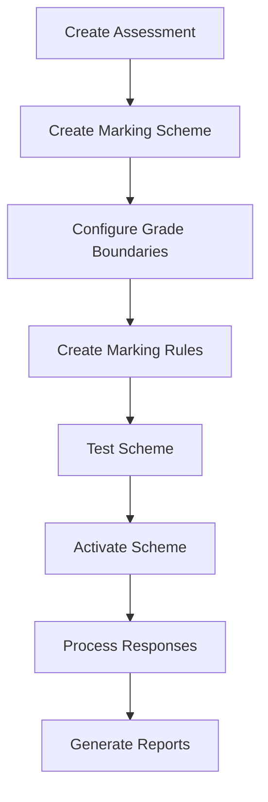

# Marking Scheme and Rules Flow Guide

This comprehensive guide explains how to create, configure, and manage marking schemes and rules through the API. It covers the complete workflow from initial setup to automated grading, with detailed examples and best practices.

## Table of Contents
1. [Overview](#overview)
2. [Workflow Overview](#workflow-overview)
3. [API Endpoints](#api-endpoints)
4. [Step-by-Step Implementation](#step-by-step-implementation)
5. [Rule Types and Configuration](#rule-types-and-configuration)
6. [Advanced Scenarios](#advanced-scenarios)
7. [Import Readiness Assessment](#import-readiness-assessment)
8. [Troubleshooting](#troubleshooting)
9. [Best Practices](#best-practices)

## Overview

### What is a Marking Scheme?
A marking scheme is a comprehensive grading system that defines how assessment responses are evaluated and scored. It consists of:
- **Marking Rules**: Specific scoring criteria for each question
- **Grade Boundaries**: Score thresholds for different grade levels
- **Feedback Templates**: Automated feedback based on performance
- **Passing Criteria**: Minimum requirements for success

### Key Benefits
- **Automated Grading**: Instant scoring without manual intervention
- **Consistent Evaluation**: Standardized criteria across all responses
- **Detailed Feedback**: Personalized feedback based on performance
- **Scalable Assessment**: Handle thousands of responses efficiently
- **Audit Trail**: Complete record of scoring decisions

## Workflow Overview



### Process Flow
1. **Setup Phase**: Create marking scheme with basic configuration
2. **Rule Creation**: Define scoring rules for each question type
3. **Testing Phase**: Validate rules with sample responses
4. **Activation**: Make scheme active for live grading
5. **Execution**: Automatic grading of user responses
6. **Reporting**: Generate scores, grades, and feedback

## API Endpoints

### Base URLs
- **Marking Schemes**: `/api/v1/admin/assessments/{assessment_id}/marking-schemes`
- **Marking Rules**: `/api/v1/admin/assessments/{assessment_id}/marking-schemes/{scheme_id}/rules`

### Authentication
All endpoints require admin authentication:
```http
Authorization: Bearer {admin_token}
Content-Type: application/json
```

## Step-by-Step Implementation

### Step 1: Create a Marking Scheme

#### Basic Scheme Creation
```http
POST /api/v1/admin/assessments/123/marking-schemes
```

```json
{
  "marking_scheme": {
    "name": "Product Import Readiness Assessment",
    "description": "Comprehensive evaluation for import readiness determination",
    "total_possible_score": 100.0,
    "settings": {
      "passing_score": 50.0,
      "grade_boundaries": {
        "Import Ready - Premium": 85,
        "Import Ready - Standard": 70,
        "Import Ready - Basic": 50,
        "Conditional Import": 25,
        "Not Import Ready": 0
      },
      "feedback_templates": {
        "Import Ready - Premium": "Excellent! Your product exceeds all import requirements and qualifies for expedited processing.",
        "Import Ready - Standard": "Great! Your product meets high import standards and is ready for standard processing.",
        "Import Ready - Basic": "Good! Your product meets minimum import requirements.",
        "Conditional Import": "Your product shows potential but requires improvements in specific areas before import approval.",
        "Not Import Ready": "Your product requires significant improvements before it can be considered for import."
      }
    }
  }
}
```

#### Response
```json
{
  "data": {
    "marking_scheme": {
      "id": 456,
      "name": "Product Import Readiness Assessment",
      "description": "Comprehensive evaluation for import readiness determination",
      "is_active": false,
      "total_possible_score": 100.0,
      "settings": {
        "passing_score": 50.0,
        "grade_boundaries": {
          "Import Ready - Premium": 85,
          "Import Ready - Standard": 70,
          "Import Ready - Basic": 50,
          "Conditional Import": 25,
          "Not Import Ready": 0
        },
        "feedback_templates": {
          "Import Ready - Premium": "Excellent! Your product exceeds all import requirements...",
          "Import Ready - Standard": "Great! Your product meets high import standards...",
          "Import Ready - Basic": "Good! Your product meets minimum import requirements.",
          "Conditional Import": "Your product shows potential but requires improvements...",
          "Not Import Ready": "Your product requires significant improvements..."
        }
      },
      "assessment_id": 123,
      "created_at": "2024-01-15T10:30:00Z",
      "updated_at": "2024-01-15T10:30:00Z"
    }
  },
  "meta": {
    "message": "Marking scheme created successfully"
  }
}
```

### Step 2: Create Marking Rules

#### Get Available Rule Types for a Question
```http
GET /api/v1/admin/assessments/123/marking-schemes/456/rules/rule-types?question_id=789
```

```json
{
  "data": {
    "rule_types": [
      {
        "key": "option_based",
        "name": "Option Based",
        "description": "Score based on selected options"
      },
      {
        "key": "exact_match",
        "name": "Exact Match",
        "description": "Score for exact text match"
      },
      {
        "key": "partial_match",
        "name": "Partial Match",
        "description": "Score for partial text match"
      }
    ],
    "default": "option_based"
  }
}
```

#### Get Criteria Fields for a Rule Type
```http
GET /api/v1/admin/assessments/123/marking-schemes/456/rules/criteria-fields?rule_type=option_based
```

```json
{
  "data": {
    "criteria_fields": [
      {
        "name": "correct_options",
        "type": "array",
        "description": "List of correct option IDs",
        "required": true
      },
      {
        "name": "partial_credit",
        "type": "boolean",
        "description": "Award partial credit for some correct options",
        "required": false,
        "default": false
      },
      {
        "name": "penalty_for_incorrect",
        "type": "number",
        "description": "Points to deduct for incorrect options",
        "required": false,
        "default": 0
      }
    ]
  }
}
```

#### Create Rules for Different Question Types

##### Multiple Choice Question Rule
```http
POST /api/v1/admin/assessments/123/marking-schemes/456/rules
```

**Note**: Rule types must be compatible with question types. Use `GET /rules/rule-types?question_id=X` to check compatibility.

```json
{
  "marking_rule": {
    "assessment_question_id": 789,
    "rule_type": "option_based",
    "points": 20.0,
    "criteria": {
      "partial_credit": true,
      "penalty_for_incorrect": 2.0
    },
    "is_active": true,
    "order": 1
  }
}
```

**Compatible Question Types**: `AssessmentQuestions::MultipleChoice`, `AssessmentQuestions::Radio`, `AssessmentQuestions::BooleanType`

##### Text Question Rule
```http
POST /api/v1/admin/assessments/123/marking-schemes/456/rules
```

```json
{
  "marking_rule": {
    "assessment_question_id": 790,
    "rule_type": "keyword_based",
    "points": 15.0,
    "criteria": {
      "keywords": ["quality", "compliance", "certification"],
      "case_sensitive": false,
      "scoring_method": "proportional"
    }
  }
}
```

**Compatible Question Types**: `AssessmentQuestions::RichText`

##### Numeric Range Question Rule
```http
POST /api/v1/admin/assessments/123/marking-schemes/456/rules
```

```json
{
  "marking_rule": {
    "assessment_question_id": 791,
    "rule_type": "range_based",
    "points": 10.0,
    "criteria": {
      "min": 1,
      "max": 100,
      "tolerance": 5
    }
  }
}
```

**Compatible Question Types**: `AssessmentQuestions::RangeType`

##### Tolerance-Based Rule (for exact values)
```json
{
  "marking_rule": {
    "assessment_question_id": 792,
    "rule_type": "tolerance_based",
    "points": 10.0,
    "criteria": {
      "expected_value": 100,
      "tolerance": 10
    }
  }
}
```

**Compatible Question Types**: `AssessmentQuestions::RangeType`

### Step 3: Bulk Create Default Rules
For assessments with many questions, create default rules automatically:

```http
POST /api/v1/admin/assessments/123/marking-schemes/456/rules/bulk-create
```

```json
{
  "data": {
    "created_count": 15,
    "marking_rules": [
      {
        "id": 501,
        "assessment_question_id": 792,
        "rule_type": "option_based",
        "points": 10.0,
        "criteria": {}
      },
      {
        "id": 502,
        "assessment_question_id": 793,
        "rule_type": "exact_match",
        "points": 15.0,
        "criteria": {}
      }
    ]
  },
  "meta": {
    "message": "Created 15 marking rules"
  }
}
```

### Step 4: Test and Validate Rules

#### Preview Scoring
**Note**: The preview endpoint is not currently implemented in the system. Use the bulk create and activation process to test schemes with real responses.

~~```http
POST /api/v1/admin/marking/preview
```~~

**Alternative**: Create a test response session and use the marking job to validate your scheme:

```json
{
  "marking_scheme_id": 456,
  "sample_responses": [
    {
      "question_id": 789,
      "response_value": [101, 102]
    },
    {
      "question_id": 790,
      "response_value": {"text": "Our product meets quality and compliance standards"}
    },
    {
      "question_id": 791,
      "response_value": {"number": 95}
    }
  ]
}
```

#### Preview Response
```json
{
  "data": {
    "preview_results": {
      "total_score": 42.5,
      "max_possible_score": 45.0,
      "percentage": 94.4,
      "grade": "Import Ready - Premium",
      "question_scores": [
        {
          "question_id": 789,
          "score_earned": 15.0,
          "max_possible": 20.0,
          "rule_applied": "option_based",
          "details": "Partial credit: 1.5/2 correct options selected"
        },
        {
          "question_id": 790,
          "score_earned": 12.0,
          "max_possible": 15.0,
          "rule_applied": "keyword_match",
          "details": "Found keywords: quality, compliance (2/3 required)"
        },
        {
          "question_id": 791,
          "score_earned": 7.0,
          "max_possible": 10.0,
          "rule_applied": "tolerance_based",
          "details": "Value 95 within partial credit range (85-95)"
        }
      ]
    }
  }
}
```

### Step 5: Activate the Scheme

```http
POST /api/v1/admin/assessments/123/marking-schemes/456/activate
```

```json
{
  "data": {
    "marking_scheme": {
      "id": 456,
      "name": "Product Import Readiness Assessment",
      "is_active": true,
      "activated_at": "2024-01-15T14:30:00Z"
    }
  },
  "meta": {
    "message": "Marking scheme activated successfully"
  }
}
```

## Rule Types and Configuration

### Rule Type Compatibility

**IMPORTANT**: Rule types must be compatible with question types. Always check compatibility before creating rules:

```http
GET /api/v1/admin/assessments/{assessment_id}/marking-schemes/{scheme_id}/rules/rule-types?question_id={question_id}
```

#### Compatibility Matrix

| Question Type | Compatible Rule Types |
|---------------|----------------------|
| `AssessmentQuestions::MultipleChoice` | `option_based` |
| `AssessmentQuestions::Radio` | `option_based` |
| `AssessmentQuestions::BooleanType` | `option_based` |
| `AssessmentQuestions::RangeType` | `range_based`, `exact_match`, `step_based`, `tolerance_based` |
| `AssessmentQuestions::RichText` | `exact_match`, `partial_match`, `keyword_based`, `format_based` |
| `AssessmentQuestions::DateType` | `date_range_based`, `exact_match` |
| `AssessmentQuestions::FileUpload` | `file_based`, `size_based`, `type_based`, `content_based` |

### 1. Option-Based Rules
For Multiple Choice, Radio, and Boolean questions.

#### Basic Configuration
```json
{
  "rule_type": "option_based",
  "criteria": {
    "correct_options": [101, 103, 105],
    "scoring_method": "all_or_nothing"
  }
}
```

#### Partial Credit Configuration
```json
{
  "rule_type": "option_based",
  "criteria": {
    "correct_options": [101, 103, 105],
    "scoring_method": "partial_credit",
    "partial_credit": true,
    "penalty_for_incorrect": 1.0
  }
}
```

#### Weighted Options
```json
{
  "rule_type": "option_based",
  "criteria": {
    "option_weights": {
      "101": 5.0,
      "103": 3.0,
      "105": 2.0
    },
    "allow_negative_scores": false
  }
}
```

### 2. Text-Based Rules

#### Exact Match
```json
{
  "rule_type": "exact_match",
  "criteria": {
    "expected_value": "ISO 9001 certified",
    "case_sensitive": false,
    "trim_whitespace": true
  }
}
```

#### Keyword Match
```json
{
  "rule_type": "keyword_match",
  "criteria": {
    "required_keywords": ["quality", "compliance", "certification"],
    "optional_keywords": ["ISO", "standards", "audit"],
    "keyword_weights": {
      "quality": 0.3,
      "compliance": 0.3,
      "certification": 0.2,
      "ISO": 0.1,
      "standards": 0.05,
      "audit": 0.05
    },
    "minimum_score_threshold": 0.6
  }
}
```

#### Pattern Match (Regex)
```json
{
  "rule_type": "pattern_match",
  "criteria": {
    "patterns": [
      {
        "regex": "^[A-Z]{2}\\d{6}$",
        "description": "Valid product code format",
        "points": 10.0
      },
      {
        "regex": "\\b(certified|approved)\\b",
        "description": "Contains certification keywords",
        "points": 5.0
      }
    ],
    "case_insensitive": true
  }
}
```

### 3. Numeric Rules

#### Tolerance-Based
```json
{
  "rule_type": "tolerance_based",
  "criteria": {
    "target_value": 100,
    "tolerance_type": "absolute",
    "tolerance_value": 5,
    "partial_credit_ranges": [
      {"min": 90, "max": 95, "credit": 0.8},
      {"min": 105, "max": 110, "credit": 0.8},
      {"min": 85, "max": 90, "credit": 0.6},
      {"min": 110, "max": 115, "credit": 0.6}
    ]
  }
}
```

#### Range-Based
```json
{
  "rule_type": "range_based",
  "criteria": {
    "scoring_ranges": [
      {"min": 90, "max": 100, "points": 10.0, "grade": "Excellent"},
      {"min": 80, "max": 89, "points": 8.0, "grade": "Good"},
      {"min": 70, "max": 79, "points": 6.0, "grade": "Satisfactory"},
      {"min": 60, "max": 69, "points": 4.0, "grade": "Needs Improvement"},
      {"min": 0, "max": 59, "points": 0.0, "grade": "Unsatisfactory"}
    ]
  }
}
```

### 4. Date-Based Rules

#### Date Range
```json
{
  "rule_type": "date_range",
  "criteria": {
    "valid_ranges": [
      {
        "start_date": "2023-01-01",
        "end_date": "2024-12-31",
        "points": 10.0,
        "description": "Valid certification period"
      }
    ],
    "future_date_penalty": 5.0,
    "past_date_penalty": 2.0
  }
}
```

### 5. File Upload Rules

#### File Validation
```json
{
  "rule_type": "file_validation",
  "criteria": {
    "required_file_types": [".pdf", ".doc", ".docx"],
    "max_file_size_mb": 10,
    "min_file_count": 1,
    "max_file_count": 3,
    "filename_patterns": [
      {
        "pattern": "certificate.*\\.(pdf|doc|docx)$",
        "points": 5.0,
        "description": "Certificate document"
      }
    ]
  }
}
```

## Advanced Scenarios

### Multi-Criteria Scoring
Combine multiple rules for complex scoring:

```json
{
  "marking_rule": {
    "assessment_question_id": 792,
    "rule_type": "multi_criteria",
    "points": 25.0,
    "criteria": {
      "sub_rules": [
        {
          "type": "keyword_match",
          "weight": 0.4,
          "criteria": {
            "required_keywords": ["quality", "compliance"]
          }
        },
        {
          "type": "length_check",
          "weight": 0.3,
          "criteria": {
            "min_length": 100,
            "max_length": 500
          }
        },
        {
          "type": "sentiment_analysis",
          "weight": 0.3,
          "criteria": {
            "positive_threshold": 0.6
          }
        }
      ],
      "minimum_total_score": 0.5
    }
  }
}
```

### Conditional Rules
Rules that apply based on other responses:

```json
{
  "marking_rule": {
    "assessment_question_id": 793,
    "rule_type": "conditional",
    "points": 15.0,
    "criteria": {
      "conditions": [
        {
          "trigger_question_id": 789,
          "trigger_response": [101],
          "rule": {
            "type": "exact_match",
            "criteria": {"expected_value": "Premium certification"}
          }
        },
        {
          "trigger_question_id": 789,
          "trigger_response": [102],
          "rule": {
            "type": "exact_match",
            "criteria": {"expected_value": "Standard certification"}
          }
        }
      ],
      "default_rule": {
        "type": "keyword_match",
        "criteria": {"required_keywords": ["certification"]}
      }
    }
  }
}
```

## Import Readiness Assessment

### Complete Example: Product Import Assessment

#### 1. Create Comprehensive Marking Scheme
```json
{
  "marking_scheme": {
    "name": "Product Import Readiness Assessment v2.0",
    "description": "Comprehensive evaluation determining import readiness with weighted criteria",
    "total_possible_score": 300.0,
    "settings": {
      "passing_score": 150.0,
      "grade_boundaries": {
        "Import Ready - Premium": 85,
        "Import Ready - Standard": 70,
        "Import Ready - Basic": 50,
        "Conditional Import": 25,
        "Not Import Ready": 0
      },
      "feedback_templates": {
        "Import Ready - Premium": "Outstanding! Your product exceeds all requirements and qualifies for expedited processing with premium benefits.",
        "Import Ready - Standard": "Excellent! Your product meets high standards and is approved for standard import processing.",
        "Import Ready - Basic": "Good! Your product meets minimum requirements and is approved for import with basic processing.",
        "Conditional Import": "Your product shows potential but requires specific improvements. Please address the highlighted areas and resubmit.",
        "Not Import Ready": "Your product requires significant improvements across multiple areas before it can be considered for import approval."
      }
    }
  }
}
```

#### 2. Quality Assessment Rules (40% weight - 120 points)
```json
{
  "marking_rule": {
    "assessment_question_id": 801,
    "rule_type": "multi_criteria",
    "points": 120.0,
    "criteria": {
      "sub_rules": [
        {
          "type": "option_based",
          "weight": 0.5,
          "criteria": {
            "correct_options": [201, 202, 203],
            "scoring_method": "weighted",
            "option_weights": {
              "201": 1.0,
              "202": 0.8,
              "203": 0.6
            }
          }
        },
        {
          "type": "keyword_match",
          "weight": 0.3,
          "criteria": {
            "required_keywords": ["ISO", "certified", "quality"],
            "keyword_weights": {
              "ISO": 0.4,
              "certified": 0.4,
              "quality": 0.2
            }
          }
        },
        {
          "type": "file_validation",
          "weight": 0.2,
          "criteria": {
            "required_file_types": [".pdf"],
            "filename_patterns": [
              {
                "pattern": "quality.*certificate",
                "points": 1.0
              }
            ]
          }
        }
      ]
    }
  }
}
```

#### 3. Compliance Assessment Rules (35% weight - 105 points)
```json
{
  "marking_rule": {
    "assessment_question_id": 802,
    "rule_type": "compliance_check",
    "points": 105.0,
    "criteria": {
      "compliance_categories": [
        {
          "name": "Safety Standards",
          "weight": 0.4,
          "required_certifications": ["CE", "FCC", "UL"],
          "scoring": {
            "all_present": 1.0,
            "partial": 0.6,
            "none": 0.0
          }
        },
        {
          "name": "Environmental Compliance",
          "weight": 0.35,
          "required_keywords": ["RoHS", "REACH", "environmental"],
          "minimum_matches": 2
        },
        {
          "name": "Documentation Completeness",
          "weight": 0.25,
          "required_documents": ["certificate", "test_report", "declaration"],
          "document_validation": true
        }
      ]
    }
  }
}
```

#### 4. Documentation Assessment Rules (15% weight - 45 points)
```json
{
  "marking_rule": {
    "assessment_question_id": 803,
    "rule_type": "documentation_score",
    "points": 45.0,
    "criteria": {
      "document_requirements": [
        {
          "type": "product_specification",
          "weight": 0.3,
          "validation": {
            "min_pages": 2,
            "required_sections": ["specifications", "materials", "dimensions"]
          }
        },
        {
          "type": "test_reports",
          "weight": 0.4,
          "validation": {
            "file_count": {"min": 1, "max": 5},
            "date_range": {"max_age_days": 365}
          }
        },
        {
          "type": "certificates",
          "weight": 0.3,
          "validation": {
            "expiry_check": true,
            "issuer_validation": ["accredited", "recognized"]
          }
        }
      ]
    }
  }
}
```

#### 5. Packaging Assessment Rules (10% weight - 30 points)
```json
{
  "marking_rule": {
    "assessment_question_id": 804,
    "rule_type": "packaging_evaluation",
    "points": 30.0,
    "criteria": {
      "packaging_criteria": [
        {
          "aspect": "material_safety",
          "weight": 0.4,
          "evaluation": {
            "approved_materials": ["cardboard", "biodegradable", "recyclable"],
            "restricted_materials": ["styrofoam", "non-recyclable"]
          }
        },
        {
          "aspect": "labeling_compliance",
          "weight": 0.35,
          "requirements": {
            "required_labels": ["origin", "contents", "warnings"],
            "language_requirements": ["english", "local"]
          }
        },
        {
          "aspect": "size_weight_compliance",
          "weight": 0.25,
          "limits": {
            "max_weight_kg": 50,
            "max_dimensions_cm": [100, 80, 60]
          }
        }
      ]
    }
  }
}
```

### Testing the Complete System

#### Sample Assessment Flow
```http
POST /api/v1/admin/marking/preview
```

```json
{
  "marking_scheme_id": 456,
  "sample_responses": [
    {
      "question_id": 801,
      "response_value": {
        "selected_options": [201, 202],
        "text": "Our product is ISO 9001 certified with quality assurance",
        "files": ["quality_certificate.pdf"]
      }
    },
    {
      "question_id": 802,
      "response_value": {
        "certifications": ["CE", "FCC"],
        "text": "Product complies with RoHS and REACH environmental standards",
        "documents": ["ce_certificate.pdf", "test_report.pdf"]
      }
    },
    {
      "question_id": 803,
      "response_value": {
        "files": [
          "product_specification_v2.pdf",
          "safety_test_report_2024.pdf",
          "iso_certificate.pdf"
        ]
      }
    },
    {
      "question_id": 804,
      "response_value": {
        "packaging_material": "recyclable_cardboard",
        "labels": ["origin", "contents", "warnings"],
        "dimensions": {"length": 80, "width": 60, "height": 40},
        "weight": 25
      }
    }
  ]
}
```

#### Expected Results
```json
{
  "data": {
    "preview_results": {
      "total_score": 255.5,
      "max_possible_score": 300.0,
      "percentage": 85.17,
      "grade": "Import Ready - Premium",
      "detailed_breakdown": {
        "quality_score": 96.0,
        "compliance_score": 84.0,
        "documentation_score": 40.5,
        "packaging_score": 25.0
      },
      "feedback": "Outstanding! Your product exceeds all requirements and qualifies for expedited processing with premium benefits.",
      "recommendations": [
        "Consider adding UL certification for enhanced compliance score",
        "Include environmental impact statement for premium documentation"
      ]
    }
  }
}
```

## Troubleshooting

### Common Issues

#### Issue: Rule Type Compatibility Error
**Symptoms**: `422 Unprocessable Entity` with "Rule type is not compatible with this question type"
**Solutions**:
1. Check available rule types: `GET /rules/rule-types?question_id=X`
2. Use the compatibility matrix above
3. Ensure you're using the correct rule type for the question type

**Example Error**:
```json
{
  "status": "error",
  "errors": [{
    "error_code": "validation_error",
    "message": "Marking rule creation failed",
    "details": {
      "errors": ["Rule type is not compatible with this question type. Available types: option_based"]
    }
  }]
}
```

#### Issue: Rules Not Applying
**Symptoms**: Responses score 0 despite meeting criteria
**Solutions**:
1. Check rule is active: `"is_active": true`
2. Verify question ID matches exactly
3. Ensure criteria format matches rule type
4. Check data types (string vs number vs array)

#### Issue: Incorrect Scoring
**Symptoms**: Unexpected scores or grades
**Solutions**:
1. Use preview endpoint to test rules
2. Check grade boundaries configuration
3. Verify points calculation logic
4. Review criteria weights and thresholds

#### Issue: Performance Problems
**Symptoms**: Slow grading with large assessments
**Solutions**:
1. Optimize complex regex patterns
2. Reduce file validation complexity
3. Use bulk operations where possible
4. Consider caching for repeated evaluations

### Debugging Tools

#### Rule Testing
```http
POST /api/v1/admin/marking-schemes/456/rules/123/test
```

```json
{
  "test_response": {
    "question_id": 789,
    "response_value": {"text": "Test response"}
  }
}
```

#### Detailed Scoring Breakdown
```http
GET /api/v1/admin/response-sessions/789/scoring-details
```

## Best Practices

### 1. Scheme Design
- **Start Simple**: Begin with basic rules, add complexity gradually
- **Test Thoroughly**: Use preview functionality extensively
- **Document Everything**: Include clear descriptions for all rules
- **Version Control**: Track changes to schemes and rules

### 2. Rule Configuration
- **Consistent Scoring**: Ensure similar questions have similar point values
- **Clear Criteria**: Make scoring criteria explicit and unambiguous
- **Partial Credit**: Consider partial credit for complex questions
- **Edge Cases**: Handle invalid or unexpected responses gracefully

### 3. Performance Optimization
- **Efficient Rules**: Avoid overly complex regex or text processing
- **Bulk Operations**: Use bulk creation for large rule sets
- **Caching**: Cache frequently used rule evaluations
- **Monitoring**: Track grading performance and optimize bottlenecks

### 4. Maintenance
- **Regular Review**: Periodically review and update rules
- **User Feedback**: Incorporate feedback from assessment results
- **Analytics**: Monitor scoring patterns and grade distributions
- **Updates**: Keep rules current with changing requirements

This comprehensive guide covers the complete marking scheme and rules workflow. For additional support or advanced configurations, consult the API documentation or contact the development team.
