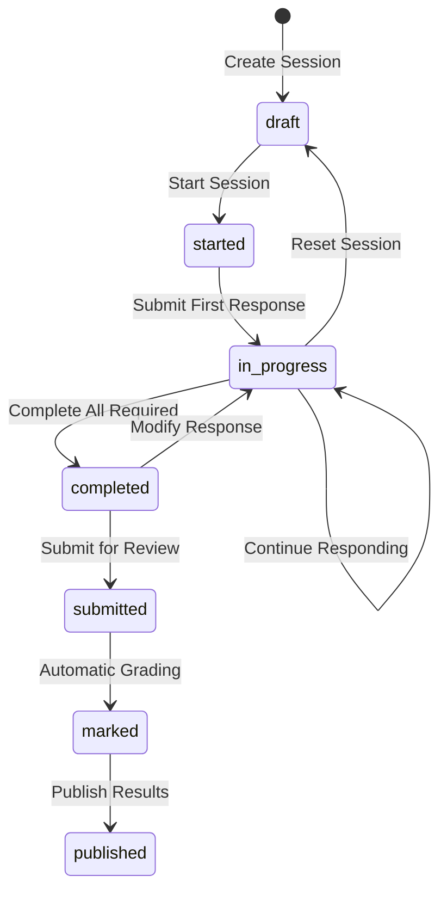

# Session Management Guide: Start to Completion

This comprehensive guide explains how to manage assessment response sessions from creation to completion using the Business API. It covers the complete user journey including session states, navigation, response submission, and conditional section handling.

## Table of Contents
1. [Overview](#overview)
2. [Session States and Lifecycle](#session-states-and-lifecycle)
3. [API Endpoints](#api-endpoints)
4. [Complete Session Flow](#complete-session-flow)
5. [Navigation and Section Management](#navigation-and-section-management)
6. [Response Submission](#response-submission)
7. [Conditional Sections in Sessions](#conditional-sections-in-sessions)
8. [Error Handling](#error-handling)
9. [Best Practices](#best-practices)
10. [Troubleshooting](#troubleshooting)

## Overview

### What is a Response Session?
A response session represents a user's attempt to complete an assessment. It tracks:
- **Progress**: Which sections have been completed
- **Responses**: All answers provided by the user
- **State**: Current status (draft, in_progress, completed, etc.)
- **Navigation**: Available sections and questions based on conditional logic
- **Metadata**: Additional information like start time, completion time

### Key Features
- **Section-by-Section Navigation**: Users progress through sections sequentially
- **Conditional Logic**: Sections appear/disappear based on previous responses
- **Auto-Save**: Responses are saved automatically
- **Validation**: Required questions must be answered before proceeding
- **Resume Capability**: Users can pause and resume sessions

## Session States and Lifecycle

### State Machine


### State Descriptions
- **draft**: Session created but not started
- **started**: User has begun the assessment
- **in_progress**: User is actively responding to questions
- **completed**: All required questions answered
- **submitted**: Session submitted for grading
- **marked**: Automatic grading completed
- **published**: Results available to user

## API Endpoints

### Base URL
All business session endpoints are under:
```
/api/v1/business/assessments/{assessment_id}/response-sessions
```

### Authentication
All endpoints require user authentication with a completed profile:
```http
Authorization: Bearer {user_token}
Content-Type: application/json
```

**Important**: Users must have a completed profile before accessing the business API. This includes:
- First name and last name
- Country selection
- Profile completion flag set to `true`

If the profile is incomplete, the API will return a 422 error with the message "Profile must be completed before accessing the API".

## Complete Session Flow

### Step 1: Create a New Session

#### Create Session
```http
POST /api/v1/business/assessments/123/response-sessions
```

**Note**: The business API automatically creates sessions for the authenticated user. No request body is required - the session is created using `AssessmentResponseSession.create_for_user(current_user, assessment)`.

#### Response
```json
{
  "status": "ok",
  "data": {
    "response_session": {
      "id": 456,
      "state": "draft",
      "respondent_name": "John Smith",
      "started_at": null,
      "completed_at": null,
      "submitted_at": null,
      "marked_at": null,
      "total_score": null,
      "max_possible_score": null,
      "grade": null,
      "feedback": null,
      "metadata": {},
      "assessment": {
        "id": 123,
        "title": "Business Assessment"
      }
    }
  },
  "notes": ["Response session created successfully"]
}
```

### Step 2: Start the Session

#### Start Session
```http
PATCH /api/v1/business/assessments/123/response-sessions/456/start
```

#### Response
```json
{
  "status": "ok",
  "data": {
    "response_session": {
      "id": 456,
      "state": "started",
      "respondent_name": "John Smith",
      "started_at": "2024-01-15T10:05:00Z",
      "completed_at": null,
      "submitted_at": null,
      "marked_at": null,
      "total_score": null,
      "max_possible_score": null,
      "grade": null,
      "feedback": null,
      "metadata": {},
      "assessment": {
        "id": 123,
        "title": "Business Assessment"
      }
    },
    "meta": {
      "first_section_id": 101,
      "links": {
        "show_section": "/api/v1/business/assessments/123/response-sessions/456/sections/101",
        "submit_section": "/api/v1/business/assessments/123/response-sessions/456/sections/101/submit"
      }
    }
  },
  "notes": ["Session started successfully; first visible section provided in meta"]
}
```

### Step 3: Navigate Through Sections

#### Get Section Details and Questions
```http
GET /api/v1/business/assessments/123/response-sessions/456/sections/101
```

#### Response
```json
{
  "status": "ok",
  "data": {
    "section": {
      "id": 101,
      "name": "Basic Information",
      "order": 1,
      "metadata": {
        "description": "Please provide your basic business information",
        "instructions": "Complete all required fields marked with an asterisk (*)"
      },
      "is_conditional": false,
      "has_country_restrictions": false,
      "questions_count": 2,
      "created_at": "2024-01-15T09:00:00Z",
      "updated_at": "2024-01-15T09:00:00Z"
    },
    "questions": [
      {
        "id": 201,
        "text": "What is your business name?",
        "type": "AssessmentQuestions::RichText",
        "question_type": "AssessmentQuestions::RichText",
        "question_type_name": "Rich Text",
        "sub_type": "short_text",
        "order": 1,
        "is_required": true,
        "active": true,
        "meta_data": {
          "validation_rule_set": {
            "min_length": 2,
            "max_length": 100
          },
          "help_text": {
            "en": "Enter the legal name of your business"
          }
        },
        "is_conditional": false,
        "has_country_restrictions": false,
        "options": [],
        "section": {
          "id": 101,
          "name": "Basic Information"
        },
        "created_at": "2024-01-15T09:00:00Z",
        "updated_at": "2024-01-15T09:00:00Z"
      },
      {
        "id": 202,
        "text": "What type of business are you?",
        "type": "AssessmentQuestions::Radio",
        "question_type": "AssessmentQuestions::Radio",
        "question_type_name": "Radio",
        "sub_type": "radio_buttons",
        "order": 2,
        "is_required": true,
        "active": true,
        "meta_data": {},
        "is_conditional": false,
        "has_country_restrictions": false,
        "options": [
          {
            "id": 301,
            "text": "Sole Proprietorship",
            "order": 1,
            "is_correct_answer": false,
            "points": 0,
            "has_assigned_points": false,
            "metadata": {},
            "created_at": "2024-01-15T09:00:00Z",
            "updated_at": "2024-01-15T09:00:00Z"
          },
          {
            "id": 302,
            "text": "Partnership",
            "order": 2,
            "is_correct_answer": false,
            "points": 0,
            "has_assigned_points": false,
            "metadata": {},
            "created_at": "2024-01-15T09:00:00Z",
            "updated_at": "2024-01-15T09:00:00Z"
          },
          {
            "id": 303,
            "text": "Corporation",
            "order": 3,
            "is_correct_answer": false,
            "points": 0,
            "has_assigned_points": false,
            "metadata": {},
            "created_at": "2024-01-15T09:00:00Z",
            "updated_at": "2024-01-15T09:00:00Z"
          },
          {
            "id": 304,
            "text": "LLC",
            "order": 4,
            "is_correct_answer": false,
            "points": 0,
            "has_assigned_points": false,
            "metadata": {},
            "created_at": "2024-01-15T09:00:00Z",
            "updated_at": "2024-01-15T09:00:00Z"
          }
        ],
        "section": {
          "id": 101,
          "name": "Basic Information"
        },
        "created_at": "2024-01-15T09:00:00Z",
        "updated_at": "2024-01-15T09:00:00Z"
      }
    ]
  },
  "notes": ["Section and questions fetched successfully"]
}
```

**Important Notes about Response Structure**:
- Section `description` and `instructions` are stored in the `metadata` field, not as direct properties
- Question `text` returns the localized text for the current user's locale
- Question validation rules are stored in `meta_data.validation_rule_set`
- All responses follow the standard API format with `status`, `data`, and `notes` fields

### Step 4: Submit Section Responses

#### Submit Responses for Current Section
```http
PATCH /api/v1/business/assessments/123/response-sessions/456/sections/101/submit
```

```json
{
  "responses": [
    {
      "question_id": 201,
      "value": {
        "text": "Acme Corporation Ltd."
      }
    },
    {
      "question_id": 202,
      "selected_option_ids": [303]
    }
  ]
}
```

#### Response - Navigation to Next Section
```json
{
  "status": "ok",
  "data": {
    "response_session": {
      "id": 456,
      "state": "in_progress",
      "respondent_name": "John Smith",
      "started_at": "2024-01-15T10:05:00Z",
      "completed_at": null,
      "submitted_at": null,
      "marked_at": null,
      "total_score": null,
      "max_possible_score": null,
      "grade": null,
      "feedback": null,
      "metadata": {},
      "assessment": {
        "id": 123,
        "title": "Business Assessment"
      }
    },
    "meta": {
      "next_section_id": 102,
      "previous_section_id": null,
      "links": {
        "show_next_section": "/api/v1/business/assessments/123/response-sessions/456/sections/102",
        "show_previous_section": null,
        "submit_section": "/api/v1/business/assessments/123/response-sessions/456/sections/101/submit"
      }
    }
  },
  "notes": ["Section submitted; navigation meta returned"]
}
```

#### Response - Missing Required Fields
```json
{
  "status": "ok",
  "data": {
    "response_session": {
      "id": 456,
      "state": "in_progress",
      "respondent_name": "John Smith",
      "started_at": "2024-01-15T10:05:00Z",
      "completed_at": null,
      "submitted_at": null,
      "marked_at": null,
      "total_score": null,
      "max_possible_score": null,
      "grade": null,
      "feedback": null,
      "metadata": {},
      "assessment": {
        "id": 123,
        "title": "Business Assessment"
      }
    },
    "meta": {
      "section_id": 101,
      "missing_required_question_ids": [201],
      "links": {
        "show_section": "/api/v1/business/assessments/123/response-sessions/456/sections/101"
      }
    }
  },
  "notes": ["Section has missing required responses"]
}
```

### Step 5: Continue Through Assessment

#### Navigate to Next Section
```http
GET /api/v1/business/assessments/123/response-sessions/456/sections/102
```

#### Handle Conditional Sections
If section 102 is conditional and becomes visible based on the Corporation selection:

```json
{
  "status": "ok",
  "data": {
    "section": {
      "id": 102,
      "name": "Corporate Governance",
      "order": 2,
      "metadata": {
        "description": "Questions about your corporate structure"
      },
      "is_conditional": true,
      "visibility_conditions": {
        "trigger_question_id": 202,
        "trigger_response_type": "option",
        "trigger_values": ["303"],
        "operator": "contains"
      },
      "has_country_restrictions": false,
      "questions_count": 1,
      "created_at": "2024-01-15T09:00:00Z",
      "updated_at": "2024-01-15T09:00:00Z"
    },
    "questions": [
      {
        "id": 203,
        "text": "How many board members do you have?",
        "type": "AssessmentQuestions::RangeType",
        "question_type": "AssessmentQuestions::RangeType",
        "question_type_name": "Range Type",
        "sub_type": "number_input",
        "order": 1,
        "is_required": true,
        "active": true,
        "meta_data": {
          "validation_rule_set": {
            "min_value": 1,
            "max_value": 50
          }
        },
        "is_conditional": false,
        "has_country_restrictions": false,
        "options": [],
        "section": {
          "id": 102,
          "name": "Corporate Governance"
        },
        "created_at": "2024-01-15T09:00:00Z",
        "updated_at": "2024-01-15T09:00:00Z"
      }
    ]
  },
  "notes": ["Section and questions fetched successfully"]
}
```

### Step 6: Complete Assessment

#### Final Section Submission
When submitting the last section with all required questions answered:

```http
PATCH /api/v1/business/assessments/123/response-sessions/456/sections/105/submit
```

#### Response - Assessment Completed
```json
{
  "status": "ok",
  "data": {
    "response_session": {
      "id": 456,
      "state": "completed",
      "respondent_name": "John Smith",
      "started_at": "2024-01-15T10:05:00Z",
      "completed_at": "2024-01-15T11:30:00Z",
      "submitted_at": null,
      "marked_at": null,
      "total_score": null,
      "max_possible_score": null,
      "grade": null,
      "feedback": null,
      "metadata": {},
      "assessment": {
        "id": 123,
        "title": "Business Assessment"
      }
    },
    "meta": {
      "next_section_id": null,
      "previous_section_id": 104,
      "links": {
        "show_previous_section": "/api/v1/business/assessments/123/response-sessions/456/sections/104",
        "submit_section": "/api/v1/business/assessments/123/response-sessions/456/sections/105/submit"
      }
    }
  },
  "notes": ["Assessment completed successfully"]
}
```

## Navigation and Section Management

### Get Current Session Status
```http
GET /api/v1/business/assessments/123/response-sessions/456
```

```json
{
  "status": "ok",
  "data": {
    "response_session": {
      "id": 456,
      "state": "in_progress",
      "respondent_name": "John Smith",
      "started_at": "2024-01-15T10:05:00Z",
      "completed_at": null,
      "submitted_at": null,
      "marked_at": null,
      "total_score": null,
      "max_possible_score": null,
      "grade": null,
      "feedback": null,
      "metadata": {},
      "assessment": {
        "id": 123,
        "title": "Business Assessment"
      }
    }
  },
  "notes": ["Response session retrieved successfully"]
}
```

### Get Saved Responses for a Section
```http
GET /api/v1/business/assessments/123/response-sessions/456/section_responses/103
```

```json
{
  "status": "ok",
  "data": {
    "section": {
      "id": 103,
      "name": "Financial Information",
      "order": 3,
      "metadata": {
        "description": "Financial details about your business"
      },
      "is_conditional": false,
      "has_country_restrictions": false,
      "questions_count": 2,
      "created_at": "2024-01-15T09:00:00Z",
      "updated_at": "2024-01-15T09:00:00Z"
    },
    "responses": [
      {
        "id": 501,
        "value": {
          "number": 500000
        },
        "metadata": {},
        "question": {
          "id": 204
        }
      },
      {
        "id": 502,
        "value": {
          "selected_option_ids": [305]
        },
        "metadata": {},
        "question": {
          "id": 205
        }
      }
    ]
  },
  "notes": ["Section responses fetched successfully"]
}
```

## Response Submission

### Different Question Types

#### Text Response
```json
{
  "question_id": 201,
  "value": {
    "text": "Acme Corporation Ltd."
  }
}
```

#### Single Choice (Radio)
```json
{
  "question_id": 202,
  "selected_option_ids": [303]
}
```

#### Multiple Choice
```json
{
  "question_id": 203,
  "selected_option_ids": [304, 305, 307]
}
```

#### Numeric Range
```json
{
  "question_id": 204,
  "value": {
    "number": 500000
  }
}
```

#### Date
```json
{
  "question_id": 205,
  "value": {
    "date": "2023-06-15"
  }
}
```

#### Boolean
```json
{
  "question_id": 206,
  "selected_option_ids": [308]
}
```

#### File Upload
```json
{
  "question_id": 207,
  "value": {
    "files": [
      {
        "filename": "business_license.pdf",
        "content_type": "application/pdf",
        "size": 1024000,
        "url": "https://storage.example.com/files/abc123.pdf"
      }
    ]
  }
}
```

### Bulk Response Submission
Submit multiple responses at once:

```json
{
  "responses": [
    {
      "question_id": 201,
      "value": {"text": "Acme Corporation"}
    },
    {
      "question_id": 202,
      "selected_option_ids": [303]
    },
    {
      "question_id": 203,
      "value": {"number": 25}
    }
  ]
}
```

## Conditional Sections in Sessions

### Dynamic Section Visibility
Sections can appear or disappear based on previous responses:

#### Example: Business Type Branching
1. **User selects "Corporation"** in Basic Information section
2. **Corporate Governance section becomes visible**
3. **Partnership section remains hidden**

#### Navigation Response with Conditional Logic
```json
{
  "meta": {
    "next_section_id": 102,
    "conditional_sections_revealed": [102],
    "conditional_sections_hidden": [106],
    "visibility_changes": {
      "section_102": {
        "status": "now_visible",
        "reason": "Business type Corporation selected",
        "trigger_question_id": 202,
        "trigger_response": "Corporation"
      }
    }
  }
}
```

### Handling Section Access Control
Users can only access sections they're authorized to see:

#### Authorized Access
```http
GET /api/v1/business/assessments/123/response-sessions/456/sections/102
```
✅ **Success**: Section is visible based on previous responses

#### Unauthorized Access
```http
GET /api/v1/business/assessments/123/response-sessions/456/sections/106
```
❌ **Error**: Section not visible due to conditional logic

```json
{
  "error": {
    "type": "AuthorizationError",
    "message": "Forbidden",
    "details": {
      "reason": "Section not visible based on current responses",
      "required_conditions": "Business type must be Partnership",
      "current_responses": "Business type: Corporation"
    }
  }
}
```

## Error Handling

### Common Error Scenarios

#### 1. Missing Required Responses
```json
{
  "error": {
    "type": "ValidationError",
    "message": "Missing required responses",
    "details": {
      "missing_questions": [
        {
          "id": 201,
          "text": "What is your business name?",
          "section_id": 101
        }
      ]
    }
  }
}
```

#### 2. Invalid Response Format
```json
{
  "error": {
    "type": "ValidationError",
    "message": "Invalid response format",
    "details": {
      "question_id": 204,
      "expected_type": "number",
      "received_type": "string",
      "received_value": "not a number"
    }
  }
}
```

#### 3. Session State Error
```json
{
  "error": {
    "type": "StateError",
    "message": "Cannot modify completed session",
    "details": {
      "current_state": "completed",
      "allowed_states": ["draft", "started", "in_progress"]
    }
  }
}
```

#### 4. Section Not Found
```json
{
  "error": {
    "type": "NotFoundError",
    "message": "Section not found",
    "details": {
      "section_id": 999,
      "assessment_id": 123
    }
  }
}
```

### Error Recovery Strategies

#### Retry with Correct Data
```javascript
// Original request failed
const response = await fetch('/api/v1/business/assessments/123/response-sessions/456/sections/101/submit', {
  method: 'PATCH',
  body: JSON.stringify({
    responses: [{
      question_id: 201,
      value: { text: "" } // Empty required field
    }]
  })
});

// Handle error and retry
if (!response.ok) {
  const error = await response.json();
  if (error.error.type === 'ValidationError') {
    // Show validation error to user
    // Retry with valid data
    const retryResponse = await fetch(url, {
      method: 'PATCH',
      body: JSON.stringify({
        responses: [{
          question_id: 201,
          value: { text: "Acme Corporation" }
        }]
      })
    });
  }
}
```

## Best Practices

### 1. Session Management
- **Auto-Save**: Save responses frequently to prevent data loss
- **Progress Tracking**: Show clear progress indicators to users
- **State Validation**: Check session state before operations
- **Timeout Handling**: Implement session timeout warnings

### 2. Navigation
- **Clear Flow**: Provide obvious next/previous navigation
- **Section Overview**: Show assessment structure to users
- **Conditional Logic**: Clearly communicate when sections appear/disappear
- **Accessibility**: Ensure navigation works with screen readers

### 3. Response Handling
- **Validation**: Validate responses client-side before submission
- **Error Messages**: Provide clear, actionable error messages
- **Data Types**: Ensure correct data types for each question
- **File Uploads**: Handle file uploads with progress indicators

### 4. Performance
- **Lazy Loading**: Load sections and questions as needed
- **Caching**: Cache session data to reduce API calls
- **Pagination**: Use pagination for large question sets
- **Compression**: Compress large response payloads

### 5. User Experience
- **Save Indicators**: Show when data is being saved
- **Offline Support**: Handle network interruptions gracefully
- **Mobile Optimization**: Ensure sessions work on mobile devices
- **Accessibility**: Support keyboard navigation and screen readers

## Troubleshooting

### Common Issues and Solutions

#### Issue: Session Won't Start
**Symptoms**: Start request returns error
**Solutions**:
1. Check session state is 'draft'
2. Verify user has permission to take assessment
3. Ensure assessment is published and active

#### Issue: Section Not Visible
**Symptoms**: Section returns 403 Forbidden
**Solutions**:
1. Check conditional logic requirements
2. Verify previous responses meet conditions
3. Review section visibility rules

#### Issue: Responses Not Saving
**Symptoms**: Submit returns success but responses lost
**Solutions**:
1. Check response format matches question type
2. Verify question IDs are correct
3. Ensure session is in valid state for updates

#### Issue: Navigation Broken
**Symptoms**: Next/previous links not working
**Solutions**:
1. Check section order and dependencies
2. Verify conditional sections are properly configured
3. Review session progress state

### Debug Information

#### Get Session Debug Info
```http
GET /api/v1/business/assessments/123/response-sessions/456?debug=true
```

```json
{
  "data": {
    "response_session": { /* session data */ },
    "debug_info": {
      "visible_sections": [101, 102, 103],
      "hidden_sections": [104, 105],
      "conditional_evaluations": {
        "section_102": "visible due to question 202 = Corporation",
        "section_104": "hidden due to question 202 != Partnership"
      },
      "validation_status": {
        "section_101": "complete",
        "section_102": "incomplete - missing question 203",
        "section_103": "not_started"
      }
    }
  }
}
```

This comprehensive guide covers the complete session management workflow from creation to completion. For additional support or advanced configurations, consult the API documentation or contact the development team.
